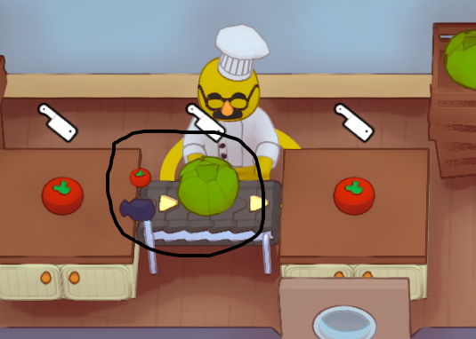

# Train Smart Grabbers only in practice mode

A mod for the game PlateUp! that makes it so that Smart Grabber's trained items can only be updated while in practice mode. This prevents accidental retraining of smart grabbers during the day, breaking automations.

Install using [Steam Workshop](https://steamcommunity.com/sharedfiles/filedetails/?id=2932832938)

## Example Scenario
1. You train a smart grabber to pull cooked turkey off of a hob.
2. During the day, you accidentally place an uncooked turkey on the smart grabber instead of on the hob.
3a. 👎[without this mod] You are now unable to cook turkey, because the grabber immediately pulls uncooked turkey off the hob. The only way to fix this is by blocking the grabber from pushing.
3b. 👍🎉[with this mod] You pick up the uncooked turkey and the smart grabber retains its original trained item, cooked turkey.

## Development
1. Checkout this repo to the following path: `YOUR_STEAM_DIR\steamapps\common\PlateUp\PlateUp\Mods\train_in_practice_mode_only` (you may have to create the `Mods` folder)
2. Open the `.sln` file in Visual Studio (this may prompt you to install "Microsoft .NET Framework 4.6.2 Developer Pack")
3. Build the project by pressing `Ctrl+Shift+B` or using the top menu
4. Open PlateUp! and start a game, you can open the Player.log file in `C:\Users\{YOUR_USER}\AppData\LocalLow\It's Happening\PlateUp` to verify you see the logs that are logged in `Mod.cs`.
5. Make any changes in `Mod.cs`, rebuild the project, close and reopen PlateUp!, you should see the impact of your changes.

### Tips
- [EnhancementMod](https://steamcommunity.com/sharedfiles/filedetails/?id=2908609256) is useful for creating specific scenarios in-game easily for testing (for example, spawning smart grabbers)
- [NoClip](https://github.com/Tremolo4/plateup-mods) is a simple mod that does not depend on KitchenLib or Harmony and is a good starter template. I used this as reference for this mod.
